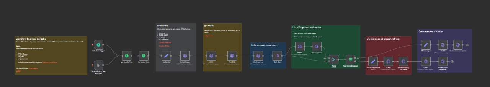

# Workflow: Snapshot Contabo

## Descrição

Este workflow no n8n é responsável por realizar backups automáticos (snapshots) das VPS hospedadas na Contabo. O processo ocorre diariamente às 00h, garantindo que todas as instâncias tenham snapshots atualizados.

## Setup e Credenciais

Para que o workflow funcione corretamente, é necessário fornecer as credenciais. Estas credenciais devem ser inseridas nos campos correspondentes na **credencial** dentro do workflow no n8n.

### Credenciais Necessárias:
- **CLIENT_ID**
- **CLIENT_SECRET**
- **API_USER**
- **API_PASSWORD**

> As credenciais podem ser obtidas diretamente no painel de controle da Contabo ([Customer Control Panel](https://my.contabo.com/api/details)).

### Links úteis:
- [Documentação da API Contabo](https://api.contabo.com/)
- [Página de credenciais da Contabo](https://my.contabo.com/api/details)

## Como Utilizar

1. **Baixe o arquivo JSON**: Faça o [download](https://github.com/FelipeWayne/automation-n8n/blob/main/Backup_Contabo_n8n/Snapshot_Contabo.json) do arquivo JSON contendo o workflow. 
   
2. **Suba o Workflow no n8n**:
   - Acesse o painel do n8n.
   - Clique em "Importar Workflow" e selecione o arquivo JSON baixado.
   
3. **Configurar as Credenciais**:
   - Após importar o workflow, edite o nó de **Credencial** e insira as informações de CLIENT_ID, CLIENT_SECRET, API_USER, e API_PASSWORD.
   
4. **Ativar o Workflow**:
   - Após as configurações, ative o workflow para que ele execute automaticamente todos os dias às 00h.

## Funcionamento do Workflow

### Fluxo Geral
1. **Trigger de Agendamento (Schedule Trigger)**: O workflow é acionado automaticamente todos os dias às 00h.

2. **Formatação da Data (Formatted Date)**: A data atual é formatada para o padrão `dd-MM-yyyy`, que será usada no nome do snapshot.

3. **Verificação de Snapshots Existentes (List Snapshots)**: Para cada instância listada, o workflow verifica se já existe um snapshot associado à instância.

4. **Decisão: Snapshot Existente**:
   - **Caso não exista um snapshot**: O workflow procede para criar um novo snapshot.
   - **Caso já exista um snapshot**: O snapshot existente é deletado antes da criação de um novo.

### Condicionais Importantes
- **Não Existe Snapshot (if node)**: Este nó decide se um snapshot já existe. Se a resposta da API indicar que não há snapshots, o workflow cria um novo.

## Informações Adicionais

- **UUIDs**: Utilizados para rastrear requisições e garantir que cada operação seja única.
- **Retentiva de Snapshot**: Caso um snapshot antigo seja encontrado, ele é removido antes da criação de um novo, garantindo que o backup seja sempre atualizado.

## Configurações do Workflow

- **Fuso Horário**: America/Sao_Paulo
- **Execução Diária**: 00h
- **Requisições à API**: Todas as requisições são feitas utilizando UUIDs gerados dinamicamente.

## Notas
- Este workflow foi criado por **Felipe Augusto**. Abaixo estão os links para suas redes:
  - [Linkedin](https://www.linkedin.com/in/felipewayne-dev/)
  - [GitHub](https://github.com/FelipeWayne)
